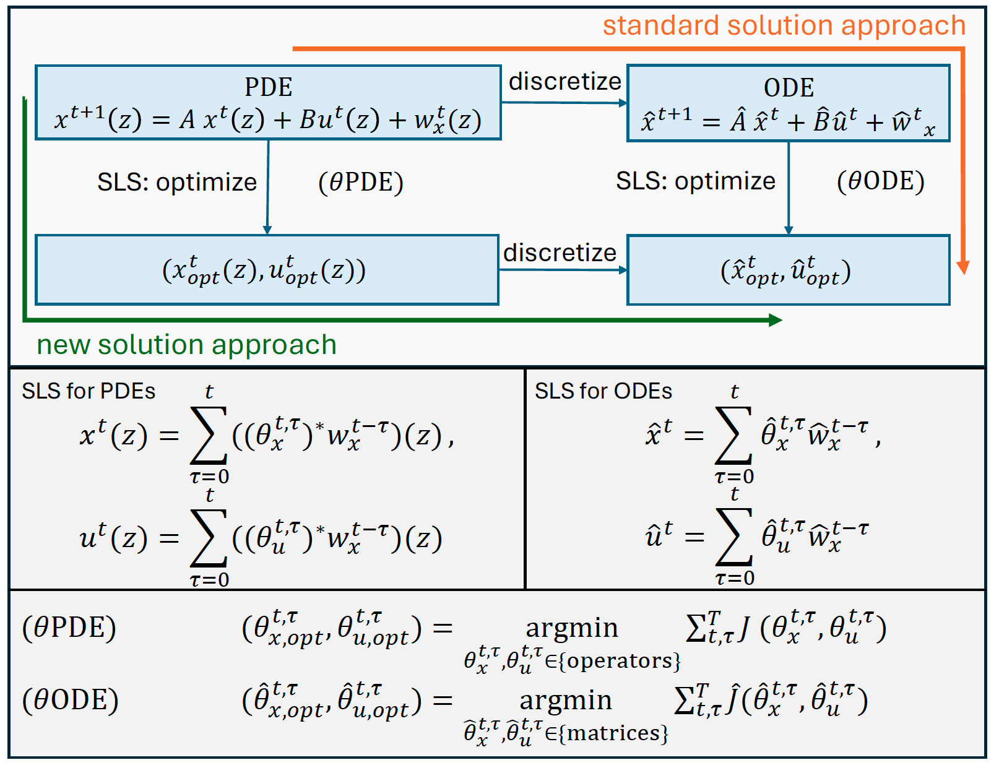

# Convex Constrained Controller Synthesis for Evolution Equations
This repository contains the python code that accompanies the research paper:
> Conger, Lauren and Leeman, Antoine P. and Hoffmann Franca “Convex Constrained Controller Synthesis for Evolution Equations”
> arXiv2410.02658 2024.



The paper is freely available on [arXiv](http://www.arxiv.org/abs/2410.02658)

## Prerequisites

Only for performance comparison:
- MATLAB (tested with version R2023b)

## Installation
1. Install Python

Ensure Python is installed on your system. You can verify this by running the following command in your terminal or command prompt:

```
python --version
```
2. Create a Virtual Environment

Navigate to your project directory and run the following commands to create and activate a virtual environment.
On Windows:

```
python -m venv venv
```
```
.\venv\Scripts\activate
```
On macOS/Linux:

```
python3 -m venv venv
```
```
source venv/bin/activate
```

3. Install Dependencies

Once the virtual environment is activated, install the dependencies from the requirements.txt file by running:

```
python -m pip install --upgrade pip
```
```
pip install -r requirements.txt
```
You can check the installed dependencies by running:

```
pip list
```

## Usage

Run the main script compute_b_coefficients_parallel.py, or the Jupyter notebook to execute the algorithms and models discussed in the paper.

- Code for Figure 2 is in baseline_functionality.ipynb.
- Code for Figure 3 is in parallel_computing.ipynb.

## License

This project is licensed under the MIT License.


## Citation

If you use this code in your research, please cite our paper:
  ```
@article{conger2024_pde_sls,
  title={Convex Constrained Controller Synthesis for Evolution Equations},
  author={Conger, Lauren and Leeman, Antoine P. and Hoffmann Franca},
  journal={arXiv preprint 2410.02658},
  year={2024}
}
  ```
